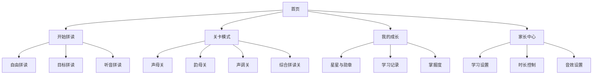

# 《拼音拼读小火车》PRD

## 1. 文档信息
- 产品名称：拼音拼读小火车
- 产品形态：移动端 Web App / PWA
- 适配终端：平板优先，兼容手机
- 部署方式：静态网页部署（GitHub Pages、Cloudflare Pages 等）
- 文档用途：作为后续产品设计、功能设计、视觉设计、交互设计、前端开发、测试验收的统一依据
- 当前版本：V1.0
- 文档状态：MVP 定义版

---

## 2. 产品概述

### 2.1 产品一句话
通过“搭积木”的方式，将声母、韵母、声调拖拽组合成音节，并即时获得发音反馈，让儿童在游戏中建立拼音拼读能力。

### 2.2 产品愿景
打造一款适合幼小衔接与小学低年级儿童的拼音启蒙产品，用可视化、可操作、可重复练习的方式，降低拼读门槛，提高学习兴趣与拼读准确率。

### 2.3 产品定位
- 教育目标：拼音拼读启蒙与巩固
- 交互特色：拖拽拼接、即时发音、轻游戏反馈
- 商业定位：可商用的儿童教育应用 MVP，可逐步扩展为课程化、会员化产品

### 2.4 核心价值
1. 让孩子“看见”音节的组成结构
2. 让孩子“听见”拼读的标准结果
3. 让孩子“动手”完成拼读过程
4. 让家长“看到”学习结果与进步

---

## 3. 背景与问题定义

### 3.1 市场背景
当前儿童拼音产品多以点读、跟读、选择题为主，缺少对“拼音结构”的可视化表达。儿童往往能记住单个拼音卡片，却难以真正理解音节如何由声母、韵母、声调组合而成。

### 3.2 用户痛点
#### 儿童端
- 难以理解拼音是如何组合成完整音节的
- 传统练习重复、枯燥，参与感弱
- 错误反馈过于生硬，容易挫败
- 触屏精度有限，复杂交互容易误触

#### 家长端
- 不清楚孩子拼音到底掌握到什么程度
- 陪练成本高，纠音难
- 很多应用娱乐性强但学习结果不可见

#### 教师/机构端（后续扩展）
- 缺少可快速上手的拼音互动练习工具
- 缺少清晰的练习进度和常错点反馈

### 3.3 机会点
- 将“拼读”设计成操作型游戏，而不是被动答题
- 通过主题化包装（小火车）提高辨识度
- 用静态部署 + PWA 降低上线与维护成本
- 用本地离线能力覆盖家庭和课堂碎片化使用场景

---

## 4. 目标与范围

### 4.1 产品目标
#### 业务目标
- 在不依赖复杂后端的情况下完成可上线 MVP
- 支持静态部署和 PWA 安装
- 形成可用于商业验证的最小产品闭环

#### 用户目标
- 儿童能独立完成基础拼读练习
- 家长能快速看到学习记录与掌握情况
- 用户在 3 分钟内理解玩法并完成首次正确拼读

#### 产品目标
- 建立“拼读积木 + 小火车”核心体验
- 完成拼音组合、合法判断、发音反馈三大基础能力
- 为后续课程化、成长体系、会员体系打下基础

### 4.2 MVP 范围
本阶段仅聚焦“拼音拼读”核心体验，不扩展到识字、句子、阅读理解等更大语文场景。

#### MVP 必做
- 拖拽声母/韵母/声调卡片组成音节
- 合法音节判断
- 自动播放音节发音
- 三种练习模式：自由拼读、目标拼读、听音拼读
- 基础激励反馈
- 本地进度记录
- PWA 安装与离线使用

#### MVP 不做
- 真人在线辅导
- 云端账号体系
- 多设备同步
- 教师后台
- AI 语音评测
- 复杂社交功能
- 识字、组词、句子训练等大内容体系

---

## 5. 目标用户

### 5.1 核心用户
#### 用户类型 A：幼小衔接儿童
- 年龄：4–6 岁
- 特征：初步接触拼音，需要高互动、低门槛
- 需求：认识结构、建立兴趣、愿意重复练习

#### 用户类型 B：小学低年级儿童
- 年龄：6–8 岁
- 特征：已学拼音但拼读不稳、混淆较多
- 需求：专项强化、纠错反馈、形成熟练度

### 5.2 付费决策人
#### 家长
- 关注点：孩子是否愿意学、是否看得到进步、是否省陪练成本
- 核心诉求：有效、轻松、可持续使用

### 5.3 后续扩展用户
#### 教师/机构
- 关注点：课堂可用性、练习管理效率、设备兼容性

---

## 6. 用户场景

### 6.1 家庭碎片化练习
儿童在家中使用平板，每次练习 5–10 分钟，通过拖拽完成若干音节拼读，结束后家长查看今日完成情况。

### 6.2 家长陪练场景
家长与儿童一起使用，家长点击目标音节或图片，孩子完成拖拽拼读并听反馈。

### 6.3 课堂补充练习（后续可兼容）
教师在平板或大屏上演示拼音组合规则，学生轮流完成拼读。

---

## 7. 核心体验设计

### 7.1 核心玩法
将声母、韵母、声调设计为不同类型的“车厢积木卡片”，用户通过拖拽将其放入拼读轨道，形成完整音节，小火车启动并播放标准发音。

### 7.2 产品主循环
1. 进入练习模式
2. 识别目标或听目标音
3. 拖拽卡片到拼读轨道
4. 系统判断是否合法
5. 自动播放标准发音
6. 给出正确/错误反馈
7. 进入下一题或继续探索

### 7.3 核心设计原则
- 低门槛：首次使用无需教程即可上手
- 强反馈：每次操作都有视觉或听觉反馈
- 低挫败：错误提示友好，不强调惩罚
- 大触控：适合平板和手机的手指操作
- 主题统一：火车、车厢、轨道、车站语义一致

---

## 8. 信息架构

---

## 9. 功能需求总览

### 9.1 模块清单
1. 首页
2. 拼读工作台
3. 三种练习模式
4. 关卡体系
5. 反馈与激励系统
6. 学习记录与成长系统
7. 家长中心
8. 音频播放系统
9. 拼音规则与校验引擎
10. PWA 与离线能力

---

## 10. 详细功能需求

## 10.1 首页

### 功能目标
快速让用户开始练习，并看到当前进度与入口。

### 功能点
- 产品 Logo 与品牌名展示
- 主按钮：开始拼读
- 模式入口：自由拼读 / 目标拼读 / 听音拼读
- 今日进度概览
- 最近成就/连续练习天数（MVP 可简化为连续完成次数）
- 家长入口

### 交互要求
- 首屏主要按钮必须在手机和平板上无需滚动可见
- 首页点击“开始拼读”默认进入上次练习模式或推荐模式

### 验收标准
- 新用户可在 3 秒内看到主要入口
- 点击开始后 1 步内进入练习页面

---

## 10.2 拼读工作台

### 功能目标
承载拖拽拼读的核心交互。

### 页面结构
- 顶部区域：题目目标/提示/返回
- 中部区域：拼读轨道（声母槽、韵母槽、声调槽）
- 底部区域：卡片池
- 辅助区域：试听、重置、提交/自动判断

### 功能点
- 显示可拖拽卡片
- 支持拖拽到指定槽位
- 支持替换已放入卡片
- 支持拖出移除或一键重置
- 实时显示当前组合结果
- 合法时高亮完整音节
- 自动触发发音与反馈

### 交互规则
- 卡片支持吸附到合法槽位
- 卡片尺寸需适配低龄儿童手指点击范围
- 放置到错误区域时给出轻提示并回弹
- 允许点按卡片替代拖拽（兼容更小屏幕和低龄用户）

### 验收标准
- 单手操作可完成核心流程
- 拖拽成功率高，不依赖精细手势
- 重置操作清晰可见

---

## 10.3 自由拼读模式

### 功能目标
让儿童自由探索拼音组合，建立结构认知。

### 功能点
- 无固定题目目标
- 用户可任意选择声母、韵母、声调
- 合法组合立即发音
- 非法组合给出友好提示
- 可重复试听已拼成音节

### 适用场景
- 新手探索
- 课后自由练习
- 家长陪玩

### 验收标准
- 用户无需理解“题目”即可独立操作
- 所有合法组合均能稳定发音

---

## 10.4 目标拼读模式

### 功能目标
通过目标驱动训练特定音节的拼读能力。

### 题目形式
- 展示目标拼音
- 展示目标汉字（后续可开关）
- 展示目标图片（后续可扩展）

### 功能点
- 系统随机或按关卡下发目标音节
- 用户拖拽正确卡片完成拼读
- 提交后判断正确性
- 正确进入下一题，错误给出提示
- 提供“再听一遍”按钮

### 反馈机制
- 正确：火车前进、星星奖励、自动发音
- 错误：提示哪个部分可能有误，如“声调再试试”

### 验收标准
- 每题目标明确
- 用户能通过至少一种提示重新尝试

---

## 10.5 听音拼读模式

### 功能目标
训练用户从听觉到拼读结构的反向映射能力。

### 功能点
- 页面加载后播放目标音节
- 用户根据声音选择声母、韵母、声调
- 支持重复播放目标音节
- 支持错后继续尝试

### 价值
- 强化听辨能力
- 避免只依赖视觉记忆

### 验收标准
- 音频播放清晰稳定
- 用户可以随时重新播放目标音

---

## 10.6 关卡模式

### 功能目标
建立循序渐进的学习路径与阶段成就感。

### 建议关卡结构
#### 第一阶段：基础认知
- 声母认知
- 韵母认知
- 声调认知

#### 第二阶段：基础拼读
- 简单开口呼组合
- 高频基础音节

#### 第三阶段：综合拼读
- 声母 + 韵母 + 声调
- 多轮连续练习

#### 第四阶段：重点难点
- j/q/x 与 ü
- zhi/chi/shi/ri
- zi/ci/si
- 整体认读音节
- y/w 相关规则

### 功能点
- 关卡列表
- 关卡解锁状态
- 关卡完成星级
- 推荐下一关

### MVP 建议
MVP 先不做复杂地图，只做列表式关卡入口。

---

## 10.7 反馈与激励系统

### 功能目标
提升儿童持续练习意愿。

### 正向反馈
- 正确后火车启动动画
- 星星、徽章、音效奖励
- 连续正确时增加连击感

### 纠错反馈
- 避免强烈红叉和失败惩罚
- 反馈要具体且轻量，例如：
  - “这两节车厢还连不上哦”
  - “声调再试试”
  - “再听一遍吧”

### 成长激励
- 今日完成次数
- 连续正确数
- 单关星级
- 解锁小火车皮肤（后续）

### 验收标准
- 每次操作都能得到明确反馈
- 错误反馈不造成明显挫败

---

## 10.8 学习记录与成长系统

### 功能目标
让家长和儿童看到学习成果，支持复习与商业转化。

### MVP 功能点
- 今日练习次数
- 已完成关卡数
- 最近拼对的音节
- 易错音节统计
- 连续练习记录

### 数据展示建议
- 用卡片方式展示，不做复杂图表
- 显示“已掌握 / 练习中 / 易错”三个状态

### 本地存储要求
- 数据默认存于本地
- 清缓存后数据可能丢失，需要在家长页说明

---

## 10.9 家长中心

### 功能目标
为家长提供可感知的控制和结果查看能力。

### MVP 功能点
- 查看学习进度
- 开关背景音乐 / 音效
- 设置学习时长提醒
- 切换难度等级（简单/标准）
- 清空本地记录
- 查看产品介绍与使用说明

### 后续扩展
- 多儿童档案
- 学习报告
- 会员入口
- 云同步

---

## 10.10 音频播放系统

### 功能目标
在拼读成功后播放标准、稳定、可离线使用的音节发音。

### 方案要求
- MVP 采用“合法音节预录音频”方案
- 不依赖浏览器 TTS 作为主发音方案
- 支持本地缓存与离线播放

### 音频触发规则
- 合法组合形成后自动播放
- 用户可点击重播
- 听音模式支持主动播放题目音

### 验收标准
- 主流移动浏览器下播放稳定
- 用户首次交互后可正常连续播放音频

---

## 10.11 拼音规则与校验引擎

### 功能目标
负责合法音节判断、标准音节输出、音频匹配与纠错提示。

### 规则引擎职责
- 校验声母 + 韵母 + 声调组合是否合法
- 输出规范显示形式
- 匹配对应音频文件
- 标记难点规则
- 为错误情况提供提示方向

### 需要覆盖的重点规则
- 零声母音节
- y/w 开头映射规则
- ü 及其显示规则
- j/q/x + ü 特例
- zhi/chi/shi/ri
- zi/ci/si
- 整体认读音节
- 常见简写形式如 iu/ui/un 的标准处理

### 验收标准
- 规则判断结果稳定一致
- 不能出现“错误合法”或“合法误判”为常态问题

---

## 10.12 PWA 与离线能力

### 功能目标
让用户拥有接近原生 App 的访问体验，并满足静态部署要求。

### 必做能力
- 可安装到手机/平板主屏幕
- 自定义应用名称、图标、启动页
- 支持离线打开核心页面
- 缓存基础练习资源和常用音频
- 二次打开加载速度快

### 技术要求
- 使用标准 Web App Manifest
- 使用 Service Worker 进行资源缓存
- 缓存策略要区分静态资源、音频资源、练习数据

### 验收标准
- 安装后可从主屏幕启动
- 断网时可进入已缓存页面并完成基础练习

---

## 11. 内容设计方案

## 11.1 内容单元
每个学习单元建议包含：
- 学习目标
- 目标音节集合
- 练习模式组合
- 复习与巩固题
- 难点提示

## 11.2 首批内容建议
MVP 不建议一次覆盖全部拼音，建议分批上线。

### 第一批（优先上线）
- 高频基础声母
- 基础单韵母
- 简单音节组合
- 常用四声音节
- 总量建议：20–40 个目标音节

### 第二批
- 复韵母
- 鼻韵母
- 重点易混项

### 第三批
- 整体认读音节
- 特殊规则专项

## 11.3 题库组织
- 按学习阶段组织
- 按练习模式组织
- 按难点标签组织
- 按是否高频使用组织

---

## 12. 交互设计规范

## 12.1 终端适配原则
- 平板优先设计
- 手机兼容
- 横屏优先，可兼容竖屏
- 主要操作区必须适配儿童单手或双手使用

## 12.2 卡片交互规范
- 卡片需有明显抓取态
- 拖拽中需有阴影/缩放反馈
- 靠近槽位时自动吸附
- 放置错误时平滑回弹
- 已放置卡片可点击替换或移除

## 12.3 误触控制
- 关键按钮需有足够点击面积
- 删除/清空操作需二次确认或弱化位置
- 避免把退出按钮放在高频操作区旁边

## 12.4 教育性提示原则
- 优先使用鼓励式语言
- 提示聚焦“下一步怎么做”
- 不使用羞辱性、否定性文案

---

## 13. 视觉设计规范

## 13.1 品牌关键词
- 温暖
- 明亮
- 积木感
- 火车主题
- 教育可信赖

## 13.2 推荐风格
主风格建议采用“明亮积木风 + 轻绘本细节”。

## 13.3 色彩建议
- 声母卡：蓝色系
- 韵母卡：绿色系
- 声调卡：橙色/紫色系
- 正确反馈：金黄/亮黄
- 弱错误反馈：浅橙/浅灰

## 13.4 视觉原则
- 圆角大卡片
- 低龄友好的字体与留白
- 图形语义清晰
- 统一的火车元素语言

## 13.5 动效原则
- 动效要短、清晰、不眩晕
- 正确反馈可有轻微庆祝感
- 页面过渡保持轻量，不影响操作效率

---

## 14. 技术方案要求

## 14.1 技术目标
- 静态部署可行
- 前端独立运行
- 支持 PWA
- 可离线运行核心能力
- 便于后续迭代和扩展

## 14.2 推荐技术栈
- 前端框架：React
- 构建工具：Vite
- 语言：TypeScript
- 样式方案：Tailwind CSS
- PWA：vite-plugin-pwa
- 本地数据：localStorage + IndexedDB

## 14.3 架构原则
- 规则与内容分离
- UI 与拼音规则引擎分离
- 音频资源按需加载与缓存
- 尽量不依赖后端

## 14.4 部署要求
- 可部署到 GitHub Pages
- 可部署到 Cloudflare Pages
- 打包后资源路径兼容静态 Hosting

---

## 15. 数据设计建议

## 15.1 核心数据实体
### 拼音卡片
- id
- type（initial/final/tone）
- text
- displayText
- colorType
- difficultyTag

### 合法音节
- id
- initial
- final
- tone
- syllable
- normalizedSyllable
- audioUrl
- tags

### 题目
- id
- mode
- targetSyllable
- promptType
- difficulty
- tags

### 学习记录
- date
- mode
- attempts
- successCount
- errorCount
- wrongSyllables
- masteredSyllables

## 15.2 存储策略
- 配置类：localStorage
- 学习记录与题目进度：IndexedDB
- 缓存资源：Service Worker Cache

---

## 16. 核心指标定义

## 16.1 产品指标
- 首次进入后完成首个正确拼读的比例
- 日均练习次数
- 单次使用时长
- 次日/7日留存
- PWA 安装率

## 16.2 学习效果指标
- 单题正确率
- 连续正确数
- 易错音节分布
- 不同模式下完成率

## 16.3 商业观察指标
- 免费用户转化为付费意愿的关键节点
- 高价值内容包的点击率
- 家长中心访问率

---

## 17. 验收标准

## 17.1 MVP 整体验收
满足以下条件可视为 MVP 可上线：
1. 用户可在首页进入任一练习模式
2. 用户可完成拖拽/点按组合声母、韵母、声调
3. 系统能判断合法与非法组合
4. 合法音节可自动播放发音
5. 正确与错误反馈完整可用
6. 学习记录可在本地保存
7. 应用可安装为 PWA
8. 断网场景下仍可访问核心功能

## 17.2 体验验收
- 手机与平板操作流畅
- 首次上手无理解门槛
- 低龄用户能独立完成基本操作
- 视觉和交互主题统一

---

## 18. 风险与应对

### 风险 1：拼音规则复杂，易出现误判
应对：
- 先收敛到首批合法音节集
- 建立规则测试样例集
- 将特殊规则显式配置化

### 风险 2：移动端拖拽体验不稳定
应对：
- 保留点按替代拖拽方案
- 增大吸附区和卡片尺寸
- 优先平板体验并兼顾手机降级

### 风险 3：音频自动播放受浏览器限制
应对：
- 用户首次交互后再启用音频
- 预加载常用音频
- 提供手动重播按钮

### 风险 4：MVP 过大导致开发周期拉长
应对：
- 控制内容量
- 控制页面数
- 暂不做云同步和复杂后台

---

## 19. 版本规划建议

## V1.0（MVP）
- 首页
- 自由拼读
- 目标拼读
- 听音拼读
- 基础关卡
- 本地记录
- PWA 安装与离线

## V1.1
- 图片题目
- 错题复习
- 更多关卡
- 更丰富成就反馈

## V1.2
- 多儿童档案
- 家长报告
- 内容包扩展
- 付费内容入口

## V2.0
- 云同步
- 教师端/机构版
- 后台内容管理
- 更完整课程体系

---

## 20. 开发优先级建议

### P0
- 拼读工作台
- 规则校验引擎
- 音频播放
- 三种练习模式
- 本地存储
- PWA 基础能力

### P1
- 关卡结构
- 成长记录
- 家长中心
- 动效与激励强化

### P2
- 图片题库
- 错题系统
- 多角色皮肤
- 高级报告能力

---

## 21. 对设计与开发的明确指导

## 21.1 对产品设计
- 所有功能围绕“拼音组合成音节”主闭环展开
- 不扩展无关大功能
- 所有新功能必须回答：是否提升拼读效率、兴趣或复习效果

## 21.2 对交互设计
- 平板优先
- 大点击区、大拖拽区、大反馈区
- 错误提示友好、可重复尝试
- 任一步骤都不应让用户卡住

## 21.3 对视觉设计
- 统一火车主题
- 区分声母、韵母、声调的视觉语义
- 保持明亮、温暖、易识别
- 不做过度复杂装饰，避免干扰学习

## 21.4 对前端开发
- 优先实现本地独立运行闭环
- 用配置驱动题目、音节和规则
- 保证静态部署兼容性
- 优先保证移动端流畅度与音频稳定性

## 21.5 对测试验收
- 覆盖主要终端：iPad、Android 平板、iPhone、Android 手机
- 覆盖离线场景
- 覆盖触屏交互
- 覆盖特殊拼音规则

---

## 22. 结论
《拼音拼读小火车》MVP 的本质不是做“更多题”，而是打造一个高可用、强反馈、低门槛的拼音拼读交互系统。产品的成功关键不在功能堆叠，而在于是否真正把“拼音结构”转化成儿童可理解、可操作、可重复练习的游戏化体验。

该 PRD 作为后续产品设计、功能设计、视觉设计、研发实现与测试验收的统一基线。后续所有设计与开发工作，均应以本 PRD 的目标、范围、规则和优先级为准。
